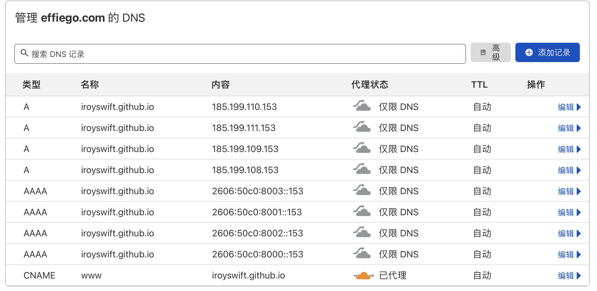

## 概览

通常，发布过程涉及两个存储库（至少两个分支）：包含源文件的分支和包含要与 GitHub Pages 一起服务的构建输出的分支。在接下来的教程中，它们将分别称为“源”和“部署”。

每个 GitHub 存储库都与 GitHub Pages 服务相关联。如果部署存储库名为 my-org/my-project（其中 my-org 是组织名称或用户名），则部署的站点将显示在https://my-org.github.io/my-project/。特别是，如果部署存储库名为my-org/my-org.github.io（组织GitHub Pages repo），该网站将显示在https://my-org.github.io/。

<!--truncate-->

```mdx-code-block
import Tabs from '@theme/Tabs';
import TabItem from '@theme/TabItem';
```

GitHub Pages 从默认分支（通常为 master/main）或 gh-pages 分支以及 root 或/doc 文件夹中提取部署就绪文件（来自 docsaurus 构建的输出）。您可以通过存储库中的 Settings > Pages。该分支将被称为“部署分支”。

我们提供了一个 docusaurus deploy 命令，帮助您在一个命令中将网站从源分支部署到部署分支：克隆、构建和提交。

## 配置

首先, 修改你的 `docusaurus.config.js` 并且添加下面参数:

| 参数               | 描述                                                                                                                                    |
| ------------------ | --------------------------------------------------------------------------------------------------------------------------------------- |
| `organizationName` | 拥有部署存储库的 GitHub 用户名或组织。                                                                                                  |
| `projectName`      | 代码库的名称。                                                                                                                          |
| `deploymentBranch` | 部署分支的名称。非组织的 GitHub Pages repos 默认为“gh-pages”（projectName 不以.github.io 结尾）。否则，这需要显式为配置字段或环境变量。 |

这些字段也有其环境变量对应字段，其优先级更高：ORGANIZATION_NAME、PROJECT_NAME 和 DEPLOYMENT_BRANCH。

:::caution

GitHub Pages 默认为 Docusaurus 网址链接添加结尾斜杠。 推荐设置 `trailingSlash` 为 (`true` or `false`, not `undefined`).

:::

示例：

```js title="docusaurus.config.js"
module.exports = {
  // ...
  url: 'https://iRoySwift.github.io', // Your website URL
  baseUrl: '/RoysBlog/',
  // highlight-start
  projectName: 'RoysBlog',
  organizationName: 'iRoySwift',
  trailingSlash: false
  // highlight-end
  // ...
};
```

## 触发 GitHub Actions 部署

[GitHub Actions](https://help.github.com/en/actions)允许您直接在存储库中自动化、自定义和执行软件开发工作流程。下面的工作流程示例假设您的网站源位于存储库的 master 分支（源分支是主分支），并且您的[publishing source](https://help.github.com/en/github/working-with-github-pages/configuring-a-publishing-source-for-your-github-pages-site)是 gh-pages 分支（部署分支是 gh-pages）

### 部署代码库:**Same**与 **Remote**

- 源代码库与部署代码库是相同的远程库
- 源代码库与部署代码库是不同的远程库

````mdx-code-block
<Tabs>
<TabItem value="same" label="Same">

虽然您可以在同一个工作流文件中定义两个作业，但原始部署工作流将始终在PR检查套件状态中列为跳过的，该状态不与实际状态通信，也不为审查过程提供任何价值。因此，我们建议将它们作为单独的工作流程进行管理。

我们将使用一个流行的第三方部署操作： [peaceiris/actions-gh-pages](https://github.com/peaceiris/actions-gh-pages#%EF%B8%8F-docusaurus).

<details>

<summary>GitHub action files</summary>

Add these two workflow files:

:::warning Tweak the parameters for your setup

These files assume you are using yarn. If you use npm, change `cache: yarn`, `yarn install --frozen-lockfile`, `yarn build` to `cache: npm`, `npm ci`, `npm run build` accordingly.

如果您的 Docusaurus 项目不在您的存储库的根目录下，您可能需要配置一个[默认工作目录](https://docs.github.com/en/actions/using-workflows/workflow-syntax-for-github-actions#example-set-the-default-shell-and-working-directory)，并相应地调整路径。

:::

```yml title=".github/workflows/deploy.yml"
name: Deploy to GitHub Pages

on:
  push:
    branches:
      - master
    # Review gh actions docs if you want to further define triggers, paths, etc
    # https://docs.github.com/en/actions/using-workflows/workflow-syntax-for-github-actions#on

jobs:
  deploy:
    name: Deploy to GitHub Pages
    runs-on: ubuntu-latest
    steps:
      - uses: actions/checkout@v2
      - uses: actions/setup-node@v3
        with:
          node-version: 16.x
          cache: yarn

      - name: Install dependencies
        run: yarn install --frozen-lockfile
      - name: Build website
        run: yarn build

      # Popular action to deploy to GitHub Pages:
      # Docs: https://github.com/peaceiris/actions-gh-pages#%EF%B8%8F-docusaurus
      - name: Deploy to GitHub Pages
        uses: peaceiris/actions-gh-pages@v3
        with:
          github_token: ${{ secrets.GITHUB_TOKEN }}
          # Build output to publish to the `gh-pages` branch:
          publish_dir: ./build
          # The following lines assign commit authorship to the official
          # GH-Actions bot for deploys to `gh-pages` branch:
          # https://github.com/actions/checkout/issues/13#issuecomment-724415212
          # The GH actions bot is used by default if you didn't specify the two fields.
          # You can swap them out with your own user credentials.
          user_name: github-actions[bot]
          user_email: 41898282+github-actions[bot]@users.noreply.github.com
```

```yml title=".github/workflows/test-deploy.yml"
name: Test deployment

on:
  pull_request:
    branches:
      - master
    # Review gh actions docs if you want to further define triggers, paths, etc
    # https://docs.github.com/en/actions/using-workflows/workflow-syntax-for-github-actions#on

jobs:
  test-deploy:
    name: Test deployment
    runs-on: ubuntu-latest
    steps:
      - uses: actions/checkout@v2
      - uses: actions/setup-node@v3
        with:
          node-version: 16.x
          cache: yarn

      - name: Install dependencies
        run: yarn install --frozen-lockfile
      - name: Test build website
        run: yarn build
```

</details>

</TabItem>
<TabItem value="remote" label="Remote">

A cross-repo publish is more difficult to set up, because you need to push to another repo with permission checks. We will be using SSH to do the authentication.

1. Generate a new [SSH key](https://help.github.com/en/github/authenticating-to-github/generating-a-new-ssh-key-and-adding-it-to-the-ssh-agent).
2. By default, your public key should have been created in `~/.ssh/id_rsa.pub`; otherwise, use the name you've provided in the previous step to add your key to [GitHub deploy keys](https://developer.github.com/v3/guides/managing-deploy-keys/).
3. Copy the key to clipboard with `xclip -sel clip < ~/.ssh/id_rsa.pub` and paste it as a [deploy key](https://developer.github.com/v3/guides/managing-deploy-keys/#deploy-keys) in your repository. Copy the file content if the command line doesn't work for you. Check the box for `Allow write access` before saving your deployment key.
4. You'll need your private key as a [GitHub secret](https://help.github.com/en/actions/configuring-and-managing-workflows/creating-and-storing-encrypted-secrets) to allow Docusaurus to run the deployment for you.
5. Copy your private key with `xclip -sel clip < ~/.ssh/id_rsa` and paste a GitHub secret with the name `GH_PAGES_DEPLOY`. Copy the file content if the command line doesn't work for you. Save your secret.
6. Create your [documentation workflow file](https://help.github.com/en/actions/configuring-and-managing-workflows/configuring-a-workflow#creating-a-workflow-file) in `.github/workflows/`. In this example it's `deploy.yml`.

<details>

<summary>GitHub action file</summary>

:::warning

Please make sure that you replace `actions@github.com` with your GitHub email and `gh-actions` with your name.

This file assumes you are using yarn. If you use npm, change `cache: yarn`, `yarn install --frozen-lockfile`, `yarn build` to `cache: npm`, `npm ci`, `npm run build` accordingly.

:::

```yml title=".github/workflows/deploy.yml"
name: Deploy to GitHub Pages

on:
  pull_request:
    branches: [main]
  push:
    branches: [main]

jobs:
  test-deploy:
    if: github.event_name != 'push'
    runs-on: ubuntu-latest
    steps:
      - uses: actions/checkout@v2
      - uses: actions/setup-node@v3
        with:
          node-version: 16.x
          cache: yarn
      - name: Install dependencies
        run: yarn install --frozen-lockfile
      - name: Test build website
        run: yarn build
  deploy:
    if: github.event_name != 'pull_request'
    runs-on: ubuntu-latest
    steps:
      - uses: actions/checkout@v2
      - uses: actions/setup-node@v3
        with:
          node-version: 16.x
          cache: yarn
      - uses: webfactory/ssh-agent@v0.5.0
        with:
          ssh-private-key: ${{ secrets.GH_PAGES_DEPLOY }}
      - name: Deploy to GitHub Pages
        env:
          USE_SSH: true
        run: |
          git config --global user.email "actions@github.com"
          git config --global user.name "gh-actions"
          yarn install --frozen-lockfile
          yarn deploy
```

</details>

</TabItem>
</Tabs>


````

:::caution 文件与修改

- 需要提交与修改的文件

  - 1. 提交 yarn.lock 文件
  - 2. 修改 package.json 中"private": false,

- Action 流程走完，修改 GitHub Pages
  - 自动化流程会自动打包代码到 gh-pages 分支下
  - 在仓库名称下，单击 Settings（设置）-> Pages。
  - 在 Source 配置项处，选择 gh-pages 分支，文件夹选择 root

:::

## 自定义域名

:::info 信息

如果您需要为 GitHub Pages 自定义域名，请在 `static` 目录中创建 `CNAME` 文件。 `static` 目录内的内容将在部署时复制到 `build` 文件夹的根目录。 使用自定义域时，请将 baseUrl: '/projectName/' 改回 baseUrl: '/'，并将您的 url 设置为自定义域名。

```
echo blog.effie.vip > CNAME
```

您可参阅 GitHub Pages 的[关于 GitHub Pages](https://docs.github.com/cn/pages/getting-started-with-github-pages/about-github-pages) 文档以了解详情。

:::

### 修改 docusaurus 配置

```js title="docusaurus.config.js"
module.exports = {
  // ...
  url: 'https://blog.effie.vip', // Your website URL
  baseUrl: '/',
  // highlight-start
  projectName: 'RoysBlog',
  organizationName: 'iRoySwift',
  trailingSlash: false
  // highlight-end
  // ...
};
```

### 修改 DNS 配置

- 配置填写参考 [Github](https://docs.github.com/cn/pages/configuring-a-custom-domain-for-your-github-pages-site/managing-a-custom-domain-for-your-github-pages-site#configuring-an-apex-domain)

- 我的 [Cloudflare](https://dash.cloudflare.com) 域名配置
  

:::caution 修改 Github custom domain

在 custom domain 处，填入域名，系统会自动检测域名是否可用

:::
