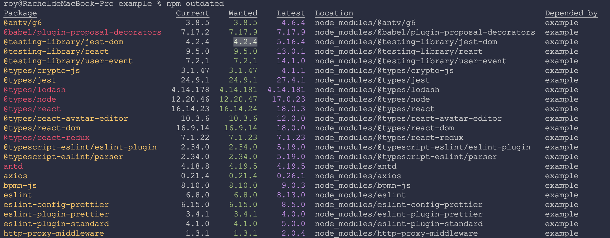

import Tabs from '@theme/Tabs';
import TabItem from '@theme/TabItem';

### 1. 查看全局安装的包

````mdx-code-block
<Tabs groupId="list">
  <TabItem value="npm" label="NPM">
    npm list -g --depth=0
  </TabItem>
  <TabItem value="same" label="YARN">
    yarn global list --depth=0
  </TabItem>
</Tabs>
````

### 2. 查看 npm 配置

````mdx-code-block
<Tabs groupId="config">
  <TabItem value="npm" label="NPM">
    npm config list -l
  </TabItem>
  <TabItem value="same" label="YARN">
    yarn config list -l
  </TabItem>
</Tabs>
````

### 3. 更新项目依赖包

import myImageUrl from './img/yarninteractive.png';

````mdx-code-block
<Tabs groupId="update">
<TabItem value="npm" label="NPM">


- 方法一
  - 安装
  ```
  npm i -g  npm-check-updates
  ```
  - 检查
  ```
  ncu
  ```
  - 更新包（yarn.lock和package.json同步更新）
  ```
  ncu -u
  ```

</TabItem>
<TabItem value="same" label="YARN">

- 方法一
  - 安装
  ```
  yarn global add npm-check-updates
  ```
  - 更新包（yarn.lock和package.json同步更新）
  ```
  ncu --upgrade --upgradeAll && yarn upgrade
  ```

- 方法二
  - 需要手动选择升级的依赖包，按空格键选择，a 键切换所有，i 键反选选择
  ```
  yarn upgrade-interactive --latest
  ```
  

- 方法三
  - yarn.lock和package.json都会更新，但是会进行版本锁定"echarts":"4.2.0-rc.2"
  ```
  yarn upgrade package@version
  ```

</TabItem>
</Tabs>

````

### 4. 查看安装包 packageName 最新发布的版本信息

```
npm view | info packageName version
```

### 5. 查看远程安装包 packageName 的所有发布的版本信息

```
npm view | info packageName versions
```

### 6. 检查过时的安装包

```
npm outdated [packageName]
```



:::info 信息

`Package` 显示包名。若使用了 --long / -l 则还是显示这个包属于 dependencies 还是 devDependency

`Current` 当前依赖包安装版本

`Wanted` 根据 package.json 包版本前缀规则可以更新的最新版本号

`Latest` 最新包版本号【默认情况下是最新的，这取决于开发人员的包管理制度】

`Location` 是该依赖包在所居于的依赖树中所在的位置

:::

### 7. npm 包发布

- npm login

```
  # Username: authorname
  # Password:
  # Email: (this IS public) email@email.com
  # Logged in as authorname on https://registry.npmjs.org/.
```

- npm publish
